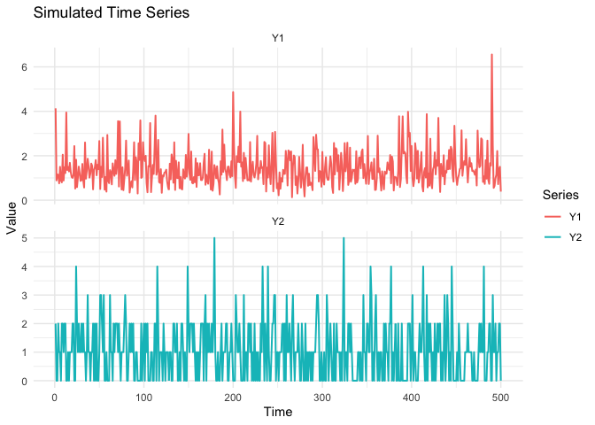
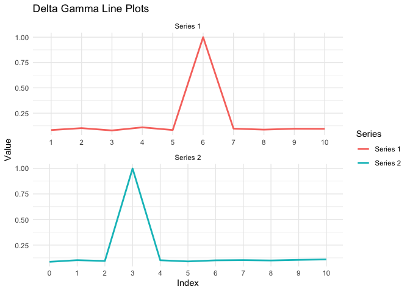

Granger Causality for Mixed Time Series GLMs
================
Luiza Piancastelli (<luiza.piancastelli@ucd.ie>)

This repository contains code for fitting for mixed-type time series.
Please ensure that you have properly configured the R to C++ interface
to be able to use Rcpp.

``` r
library(Rcpp)
library(dplyr)
```

    ## 
    ## Attaching package: 'dplyr'

    ## The following objects are masked from 'package:stats':
    ## 
    ##     filter, lag

    ## The following objects are masked from 'package:base':
    ## 
    ##     intersect, setdiff, setequal, union

``` r
library(ggplot2)
library(tidyr)

source("Rfunctions.R")
sourceCpp("cpp_functions.cpp")
```

We provide a reproducible example of simulating and fitting a bivariate
time series model where one series is continuous and the other is
integer-valued. Specifically, we simulate bivariate time series from a
model:

$Y_{1\,t}|\mathcal F^{(1)}_{t-1}\sim\mbox{Gamma}^{(1)}(\mu_{1\,t},\phi)$
and
$Y_{2\,t}|\mathcal F^{(1,2)}_{t-1}{\mathcal G_t^{1}}\sim\mbox{Poisson}^{(2)}(\mu_{2\,t})$,
where

$\nu_{2\,t} = g_2(\mu_{2\,t}) = \beta_0^{(2)}+\sum_{i=1}^p \beta_i^{(2)}\widetilde Y_{2\, t-i}+\sum_{l=0}^k \gamma^{(2)}_l \widetilde Y_{1\, t-l}$

$\nu_{1\,t} = g_1(\mu_{1\,t}) = \beta_0^{(1)}+\sum_{i=1}^r \beta_i^{(1)}\widetilde Y_{1\, t-i}+\sum_{l=1}^q \gamma^{(1)}_l\widetilde Y_{2\, t-l}$

Please refer to the paper for a detailed description of the model. In
terms of the parameters, we have that:  
The function `rPoisGamma` is used below to generate a bivariate time
series of 500 observations, autorregressive lags of order 1 for both
series and cross-series lags of orders 6 ($Y_2$ to $Y_1$ direction) and
3 ($Y_1$ to $Y_2$ direction).

``` r
beta1 = c(0.6, -0.1)
beta2 = c(-0.2, 0.3)
gamma1 = c(rep(0, 5), -0.4)
gamma2 = c(rep(0,3), 0.3)
phi= 0.2
           
Y= rPoisGamma(500,  beta1, beta2, gamma1, gamma2, phi)
```

``` r
# Convert matrix to data frame
df <- as.data.frame(Y)
df$time <- 1:nrow(Y)

# Reshape to long format for ggplot
df_long <- df %>%
  pivot_longer(cols = -time, names_to = "series", values_to = "value")

# Plot (both series in same panel)
ggplot(df_long, aes(x = time, y = value, color = series)) +
  geom_line(size = .7) +  theme_minimal() +
  labs(title = "Simulated Time Series",
       x = "Time", y = "Value", color = "Series")+ facet_wrap(~ series, ncol = 1, scales = "free_y")
```

<!-- --> Next, we fit
the model using the Bayesian approach with spike and slab priors for
$\gamma^{(1)}$ and $\gamma^{(2)}$. This approach allows for automatic
selection of non-zero effects, starting from a potentially large number
of lags. The (Dirac) spike and slab prior is defined as:

$$
\gamma^{(j)}_i \sim (1 - \delta^{(j)}_i)\, \delta_0 + \delta^{(j)}_i\, \mathcal{N}(0, \sigma^2_j), \quad j = 1,2
$$

where:
This prior encourages , so that only a subset of $\gamma^{(1)}$ and
$\gamma^{(2)}$ are non-zero. The function `fit_mcmc` implements a Markov
Chain Monte Carlo (MCMC) algorithm to sample from the posterior
distribution of the model parameters, including the $\delta^{(j)}_i$
indicators. The hyperparameters for the priors are specified as a named
list `priors`:

``` r
args(fit_mcmc)
```

    ## function (r, p, s, k, Y, N, priors, dist1, dist2) 
    ## NULL

``` r
priors = list("sd_b1" = 3,
              "sd_b2" = 3,
              "sd_g1" = 3,
              "sd_g2" = 3,
              "a" = 1, "b" =1,
              "rate_phi" =1)
```

The terms `sd_g1` and `sd_g2` correspond to the above
$\sigma_1, \sigma_2$, and `a` and `b` are the parameters of the Beta
prior for the inclusion probabilities. `sd_b1` and `sd_b2` are the
standard deviations of Normal priors assumed for the $\beta$ parameters,
and $\phi \sim$ Exponential( rate = `rate_phi`)\$. The other parameters
expected by the function are:
The line below fits the “gamma” “poisson” model to the simulated data,
with autorregressive orders of 1 and maximum of 10 for the cross-series
effects. The MCMC is run for 10,000 iterations, and the results are
stored in the `fit` object.

``` r
fit =fit_mcmc(1,1,10,10,Y, N=10000, priors, "gamma", "poisson")
```

    ## [=====                                             ]  10%[==========                                        ]  20%[===============                                   ]  30%[====================                              ]  40%[=========================                         ]  50%[==============================                    ]  60%[===================================               ]  70%[========================================          ]  80%[=============================================     ]  90%[==================================================] 100%
    ## Done!

``` r
str(fit)
```

    ## List of 9
    ##  $ beta1       : num [1:10000, 1:2] 0.497 0.497 0.497 0.51 0.51 ...
    ##  $ beta2       : num [1:10000, 1:2] -0.239 -0.239 -0.239 -0.239 -0.239 ...
    ##  $ gamma1      : num [1:10000, 1:10] 0.037 -0.0719 -0.2964 0.031 0.6326 ...
    ##  $ gamma2      : num [1:10000, 1:11] 0.05176 0.08371 -0.00184 0.10874 0.10874 ...
    ##  $ phi         : num [1:10000] 0.214 0.231 0.231 0.232 0.232 ...
    ##  $ delta_gamma1: num [1:10] 0.0832 0.1023 0.0794 0.11 0.0835 ...
    ##  $ delta_gamma2: num [1:11] 0.0866 0.1025 0.0949 0.9981 0.1017 ...
    ##  $ time        : num 690
    ##  $ loglik      : num [1:10000] -1094 -1096 -1099 -1098 -1098 ...

The `fit` object contains the MCMC samples for all model parameters,
including the $\delta^{(1)}$ and $\delta^{(2)}$ indicators. The
posterior inclusion probabilities for each lag can be computed as the
mean of the corresponding $\delta$ samples across the MCMC iterations.
The lines below compute and plot these posterior inclusion probabilities
per lag:

``` r
# Plot the inclusion probabilities
df1 <- data.frame(x = 1:length(fit$delta_gamma1), y = fit$delta_gamma1, series = "Series 1")
df2 <- data.frame(x = 0:(length(fit$delta_gamma2)-1), y = fit$delta_gamma2, series = "Series 2")
df <- bind_rows(df1, df2)


# Plot
ggplot(df, aes(x = factor(x), y = y, color = series)) +
  geom_line(size = 1,aes(group = 1)) +
  theme_minimal() +
  labs(x = "Index", y = "Value", color = "Series",
       title = "Delta Gamma Line Plots")+facet_wrap(~ series, ncol = 1, scales = "free")
```

<!-- -->
